The Hubway trip history data
================
Amandeep Rathee
October 10, 2016

The Hubway trip history data
============================

Every time a Hubway user checks a bike out from a station, the system records basic information about the trip. Those anonymous data points have been exported into the spreadsheet. Please note, all private data including member names have been removed from these files.

Input
=====

``` r
hub <- read.csv("hubway_trips.csv")
str(hub)
```

    ## 'data.frame':    1579025 obs. of  13 variables:
    ##  $ seq_id    : int  1 2 3 4 5 6 7 8 9 10 ...
    ##  $ hubway_id : int  8 9 10 11 12 13 14 15 16 17 ...
    ##  $ status    : Factor w/ 1 level "Closed": 1 1 1 1 1 1 1 1 1 1 ...
    ##  $ duration  : int  9 220 56 64 12 19 24 7 8 1108 ...
    ##  $ start_date: Factor w/ 521432 levels "10/1/2011 00:01:00",..: 337342 337343 337344 337345 337346 337347 337348 337349 337350 337351 ...
    ##  $ strt_statn: int  23 23 23 23 23 23 23 23 23 47 ...
    ##  $ end_date  : Factor w/ 515102 levels "10/1/2011 00:00:00",..: 333544 333545 333546 333547 333548 333549 333550 333551 333552 333559 ...
    ##  $ end_statn : int  23 23 23 23 23 23 23 23 23 40 ...
    ##  $ bike_nr   : Factor w/ 1164 levels "","A07799","A07800",..: 484 569 472 569 569 472 569 569 569 565 ...
    ##  $ subsc_type: Factor w/ 2 levels "Casual","Registered": 2 2 2 2 2 2 2 2 2 2 ...
    ##  $ zip_code  : Factor w/ 531 levels "","'00210","'00216",..: 523 233 168 176 522 143 199 199 522 104 ...
    ##  $ birth_date: int  1976 1966 1943 1981 1983 1951 1971 1971 1983 1994 ...
    ##  $ gender    : Factor w/ 3 levels "","Female","Male": 3 3 3 2 2 3 2 2 2 3 ...

Pre-processing data.
====================

Converting start-date and end-date to POSIXlt format and creating new vectors for month, day of the month and hour of the day using dplyr package.

``` r
library(dplyr)
```

    ## 
    ## Attaching package: 'dplyr'

    ## The following objects are masked from 'package:stats':
    ## 
    ##     filter, lag

    ## The following objects are masked from 'package:base':
    ## 
    ##     intersect, setdiff, setequal, union

``` r
# deleting status since it only has one unique value.
hub$status <- NULL

# converting duration from seconds to minutes
hub$duration <- hub$duration/60

# converting the date variables POSIXlt date.

hub$start_date <- as.character(hub$start_date)

hub$start_date <- strptime(hub$start_date , format = "%m/%d/%Y %H:%M:%S")

hub$end_date <- strptime(hub$end_date , format = "%m/%d/%Y %H:%M:%S")

hub$start_date <- as.POSIXct(hub$start_date)
hub$end_date <- as.POSIXct(hub$end_date)

hub_with_time <- hub %>% mutate(start_month = format(hub$start_date, "%m"), start_day = format(hub$start_date, "%d"), start_hour = format(hub$start_date, "%H"), end_month = format(hub$end_date, "%m"), end_day = format(hub$end_date, "%d"), end_hour = format(hub$end_date, "%H"))

hub_with_time$start_day <- as.integer(hub_with_time$start_day)
hub_with_time$start_hour <- as.integer(hub_with_time$start_hour)
hub_with_time$end_day <- as.integer(hub_with_time$end_day)
hub_with_time$end_hour <- as.integer(hub_with_time$end_hour)

# start month has values from month 3 to 11 i.e. march to november.
hub_with_time$start_month[hub_with_time$start_month == "03"] <- "March"
hub_with_time$start_month[hub_with_time$start_month == "04"] <- "April"
hub_with_time$start_month[hub_with_time$start_month == "05"] <- "May"
hub_with_time$start_month[hub_with_time$start_month == "06"] <- "June"
hub_with_time$start_month[hub_with_time$start_month == "07"] <- "July"
hub_with_time$start_month[hub_with_time$start_month == "08"] <- "August"
hub_with_time$start_month[hub_with_time$start_month == "09"] <- "September"
hub_with_time$start_month[hub_with_time$start_month == "10"] <- "October"
hub_with_time$start_month[hub_with_time$start_month == "11"] <- "November"

# end_month has values from 2 to 12 i.e. february to december.
hub_with_time$end_month[hub_with_time$end_month == "02"] <- "February"
hub_with_time$end_month[hub_with_time$end_month == "03"] <- "March"
hub_with_time$end_month[hub_with_time$end_month == "04"] <- "April"
hub_with_time$end_month[hub_with_time$end_month == "05"] <- "May"
hub_with_time$end_month[hub_with_time$end_month == "06"] <- "June"
hub_with_time$end_month[hub_with_time$end_month == "07"] <- "July"
hub_with_time$end_month[hub_with_time$end_month == "08"] <- "August"
hub_with_time$end_month[hub_with_time$end_month == "09"] <- "September"
hub_with_time$end_month[hub_with_time$end_month == "10"] <- "October"
hub_with_time$end_month[hub_with_time$end_month == "11"] <- "November"
hub_with_time$end_month[hub_with_time$end_month == "12"] <- "December"

hub_with_time$start_month <- ordered(hub_with_time$start_month, levels = c("March","April","May","June","July","August","September","October","November"))
hub_with_time$end_month <- ordered(hub_with_time$end_month, levels = c("February","March","April","May","June","July","August","September","October","November","December"))
```

Exploratory Data Analysis
=========================

In the following graph we can see a slightly negative correlation between age and duration of trip. We should keep in mind that 80% data about age is missing.

``` r
library(ggplot2)
library(gridExtra)
```

    ## 
    ## Attaching package: 'gridExtra'

    ## The following object is masked from 'package:dplyr':
    ## 
    ##     combine

``` r
# ============================ age vs duration ============================

hub_with_time$age <- 2016- hub_with_time$birth_date
ggplot(data = hub_with_time, aes(x = age, y = duration/60, color = gender)) + geom_jitter(alpha = 1/4) + scale_y_continuous(limits = c(0,quantile(hub_with_time$duration,0.99)/60)) + scale_x_continuous(breaks = seq(20,90,5)) + labs(title = "Age vs Duration", x = "Age of Rider", y = "Trip Duration(in minutes")
```

    ## Warning: Removed 1229288 rows containing missing values (geom_point).

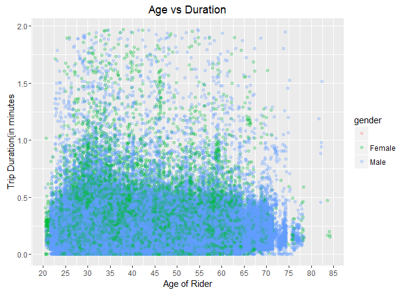

Now let us look at some boxplots.

We would think that Registered users would use bikes more frequently and for longer durations. But the following graph reveals the opposite.

``` r
# ============================ subscriber type vs duration ============================

table(hub_with_time$subsc_type)
```

    ## 
    ##     Casual Registered 
    ##     472611    1106414

``` r
tapply(hub_with_time$duration, hub_with_time$subsc_type, mean)
```

    ##     Casual Registered 
    ##   38.22404   12.22215

``` r
ggplot(data = hub_with_time, aes(x = subsc_type, y = duration)) + geom_boxplot(fill = "#A5A5A5", color = "#000022") + scale_y_continuous(breaks = seq(0,40,3)) + coord_cartesian(ylim = c(0,40)) + labs(title = "Customer type vs Duration of trip", x = "Customer type", y = "Duration of trip (in minutes)")
```

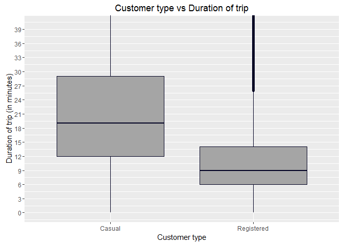

Now let us look at the gender vs duration boxplot. Interestingly female users have slightly more duration on average.

``` r
# ============================ gender vs duration ============================

prop.table(table(hub_with_time$gender))*100
```

    ## 
    ##            Female     Male 
    ## 29.93056 17.20682 52.86262

``` r
# 30 % data about gender is missing.
tapply(hub_with_time$duration, hub_with_time$gender, mean)
```

    ##            Female     Male 
    ## 38.22404 13.57485 11.78185

``` r
ggplot(data = hub_with_time, aes(x = gender, y = duration)) + geom_boxplot(fill = "#A5A5A5", color = "#000022") + scale_y_continuous(breaks = seq(0,40,3)) + coord_cartesian(ylim = c(0,40)) + labs(title = "Gender vs Duration of trip", x = "Gender", y = "Duration of trip (in minutes)")
```

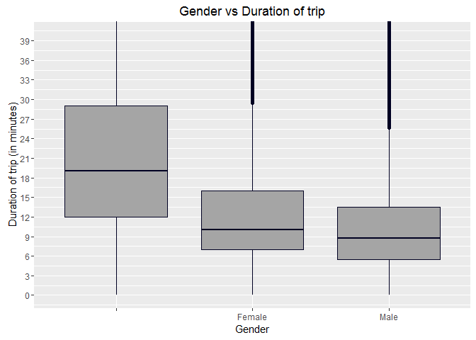

Start station vs duration. Station number 15, 37, 92(highest in terms of duration) and 120 seem to dominate here.

``` r
start_station_box1 <- ggplot(data = hub_with_time, aes(x = as.factor(strt_statn), y = duration)) + geom_boxplot(fill = "#A5A5A5", color = "#000022") + scale_y_continuous(limits = c(0,quantile(hub_with_time$duration,0.99)), breaks = seq(0,50,5)) + coord_cartesian(xlim = c(0,47), ylim = c(0,50)) + labs(title = "Start Staion vs Duration", x = "", y = "Trip Duration (in minutes)")

start_station_box2 <- ggplot(data = hub_with_time, aes(x = as.factor(strt_statn), y = duration)) + geom_boxplot(fill = "#A5A5A5", color = "#000022") + scale_y_continuous(limits = c(0,quantile(hub_with_time$duration,0.99)), breaks = seq(0,50,5)) + coord_cartesian(xlim = c(48,95), ylim = c(0,50)) + labs(x = "", y = "Trip Duration (in minutes)")

start_station_box3 <- ggplot(data = hub_with_time, aes(x = as.factor(strt_statn), y = duration)) + geom_boxplot(fill = "#A5A5A5", color = "#000022") + scale_y_continuous(limits = c(0,quantile(hub_with_time$duration,0.99)), breaks = seq(0,50,5)) +  coord_cartesian(xlim = c(96,145), ylim = c(0,50)) +labs(x = "Start Station number", y = "Trip Duration (in minutes)")

grid.arrange(start_station_box1, start_station_box2, start_station_box3, nrow = 3)
```

    ## Warning: Removed 15837 rows containing non-finite values (stat_boxplot).

    ## Warning: Removed 15837 rows containing non-finite values (stat_boxplot).

    ## Warning: Removed 15837 rows containing non-finite values (stat_boxplot).


A similar boxplot for End Stations. The same stations dominate here also.

``` r
end_station_box1 <- ggplot(data = hub_with_time, aes(x = as.factor(end_statn), y = duration)) + geom_boxplot(fill = "#A5A5A5", color = "#000022") + scale_y_continuous(limits = c(0,quantile(hub_with_time$duration,0.99)), breaks = seq(0,50,5)) + coord_cartesian(xlim = c(0,47), ylim = c(0,50)) + labs(title = "End Staion vs Duration", x = "", y = "Trip Duration (in minutes)")

end_station_box2 <- ggplot(data = hub_with_time, aes(x = as.factor(end_statn), y = duration)) + geom_boxplot(fill = "#A5A5A5", color = "#000022") + scale_y_continuous(limits = c(0,quantile(hub_with_time$duration,0.99)), breaks = seq(0,50,5)) + coord_cartesian(xlim = c(48,95), ylim = c(0,50)) + labs(x = "", y = "Trip Duration (in minutes)")

end_station_box3 <- ggplot(data = hub_with_time, aes(x = as.factor(end_statn), y = duration)) + geom_boxplot(fill = "#A5A5A5", color = "#000022") + scale_y_continuous(limits = c(0,quantile(hub_with_time$duration,0.99)), breaks = seq(0,50,5)) + coord_cartesian(xlim = c(96,145), ylim = c(0,50)) +labs(x = "End Station number", y = "Trip Duration (in minutes)")

grid.arrange(end_station_box1, end_station_box2, end_station_box3, nrow = 3)
```

    ## Warning: Removed 15837 rows containing non-finite values (stat_boxplot).

    ## Warning: Removed 15837 rows containing non-finite values (stat_boxplot).

    ## Warning: Removed 15837 rows containing non-finite values (stat_boxplot).

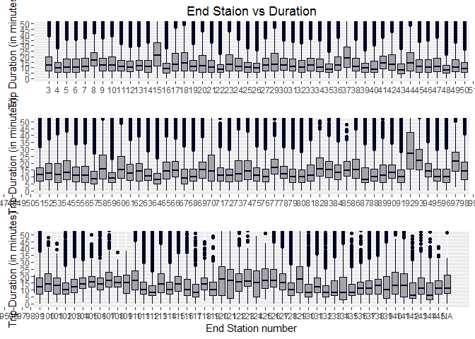

Let us create a new variable x which will contain 1 if start and end stations of a trip are same and 0 otherwise. The following graph depicts that duration is almost 2.5 times longer when start and end stations are same. This can be due to the fact that when start and end stations are same the rider has to come back again to the same station after the journey. This is not the case in case of different start and end stations.

``` r
x <- ifelse(hub_with_time$strt_statn == hub_with_time$end_statn, 1, 0)
ggplot(data = hub_with_time, aes(x = as.factor(x), y = duration)) + geom_boxplot(fill = "#A5A5A5", color = "#000022") + scale_y_continuous(limits = c(0,quantile(hub_with_time$duration,0.99)), breaks = seq(0,50,5)) + labs(x = "1-Same start and end stations. 0- Different start and end stations", y = "Trip duration (in minutes)")
```

    ## Warning: Removed 15837 rows containing non-finite values (stat_boxplot).

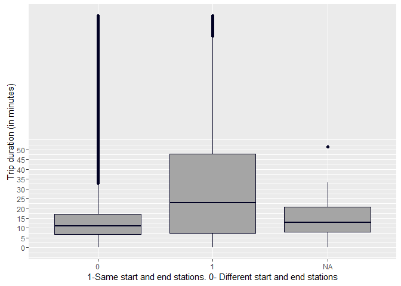

Now let's compare how trip duration is affected based on different months, day of the month and hour of the day.

Longer trip durations result when bike is rented/returned in December. Similarly when bike is rented/returned between 00:00 to 4:00 and 13:00 to 16:00 it also results in longer trip duration.

``` r
ggplot(data = hub_with_time, aes( x = start_month, y = duration)) + geom_boxplot(fill = "#A5A5A5", color = "#000022") + scale_y_continuous(limits = c(0,quantile(hub_with_time$duration,0.99)), breaks = seq(0,50,5)) + labs(title = "Trip start month vs Trip duration", x = "Trip Start Month", y = "Trip duration (in minutes)")
```

    ## Warning: Removed 15837 rows containing non-finite values (stat_boxplot).


``` r
ggplot(data = hub_with_time, aes( x = as.factor(start_day), y = duration)) + geom_boxplot(fill = "#A5A5A5", color = "#000022") + scale_y_continuous(limits = c(0,quantile(hub_with_time$duration,0.95)), breaks = seq(0,50,5)) + labs(title = "Trip start day vs Trip duration", x = "Trip Start Day", y = "Trip duration (in minutes)")
```

    ## Warning: Removed 78853 rows containing non-finite values (stat_boxplot).


``` r
ggplot(data = hub_with_time, aes( x = as.factor(start_hour), y = duration)) + geom_boxplot(fill = "#A5A5A5", color = "#000022") + scale_y_continuous(limits = c(0,quantile(hub_with_time$duration,0.95)), breaks = seq(0,100,5)) + labs(title = "Trip start hour vs Trip duration", x = "Trip Start Hour", y = "Trip duration (in minutes)")
```

    ## Warning: Removed 78853 rows containing non-finite values (stat_boxplot).

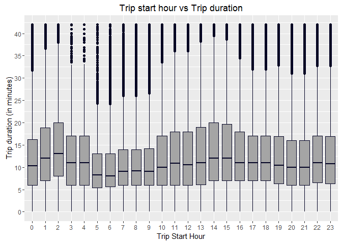

``` r
ggplot(data = hub_with_time, aes( x = end_month, y = duration)) + geom_boxplot(fill = "#A5A5A5", color = "#000022") + scale_y_continuous(limits = c(0,quantile(hub_with_time$duration,0.95)), breaks = seq(0,50,5)) + labs(title = "Trip end month vs Trip duration", x = "Trip End Month", y = "Trip duration (in minutes)")
```

    ## Warning: Removed 78853 rows containing non-finite values (stat_boxplot).

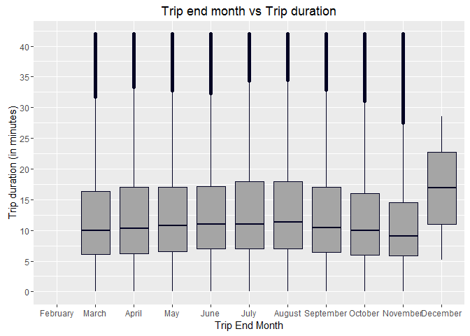

``` r
ggplot(data = hub_with_time, aes( x = as.factor(end_day), y = duration)) + geom_boxplot(fill = "#A5A5A5", color = "#000022") + scale_y_continuous(limits = c(0,quantile(hub_with_time$duration,0.95)), breaks = seq(0,50,5)) + labs(title = "Trip end day vs Trip duration", x = "Trip end day", y = "Trip duration (in minutes)")
```

    ## Warning: Removed 78853 rows containing non-finite values (stat_boxplot).

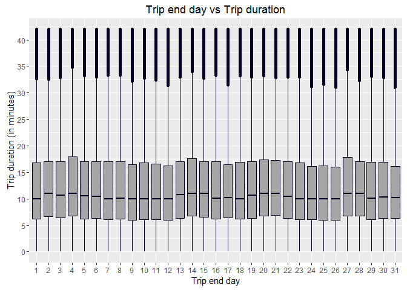

``` r
ggplot(data = hub_with_time, aes( x = as.factor(end_hour), y = duration)) + geom_boxplot(fill = "#A5A5A5", color = "#000022") + scale_y_continuous(limits = c(0,quantile(hub_with_time$duration,0.95)), breaks = seq(0,50,5)) + labs(title = "Trip end hour vs Trip duration", x = "Trip end hour", y = "Trip duration (in minutes)")
```

    ## Warning: Removed 78853 rows containing non-finite values (stat_boxplot).

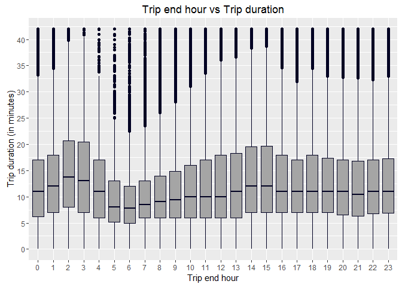

Now let us look at some histograms.

The duration histogram shows most users rent their bike for 6 minutes.

``` r
ggplot(data = hub_with_time, aes(x = duration)) + geom_histogram(binwidth = 2, fill = "#A3333D", color = "black") + scale_x_continuous(limits = c(0,quantile(hub_with_time$duration, 0.95)), breaks = seq(0,40,2)) + labs(x = "Duration (in minutes)")
```

    ## Warning: Removed 78853 rows containing non-finite values (stat_bin).

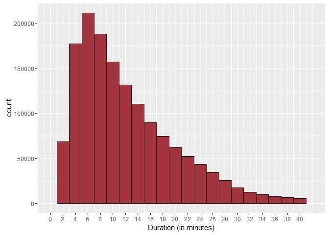

The following plot shows that station 22 and 36 are the most popular start stations.

``` r
start_station_p1 <- ggplot(data = hub_with_time, aes(x = strt_statn)) + geom_histogram(binwidth = 1, fill = "#006494", color = "black") + scale_x_continuous(breaks = seq(3,145,1)) + coord_cartesian(xlim = c(3,78)) + scale_y_continuous(breaks = seq(0,60000,10000)) + labs(x = "")
start_staion_p2 <- ggplot(data = hub_with_time, aes(x = strt_statn)) + geom_histogram(binwidth = 1, fill = "#006494", color = "black") + scale_x_continuous(breaks = seq(3,145,1)) + coord_cartesian(xlim = c(79,145)) + scale_y_continuous(breaks = seq(0,60000,10000)) + labs(x = "Start Station")

grid.arrange(start_station_p1, start_staion_p2, nrow = 2)
```

    ## Warning: Removed 14 rows containing non-finite values (stat_bin).

    ## Warning: Removed 14 rows containing non-finite values (stat_bin).

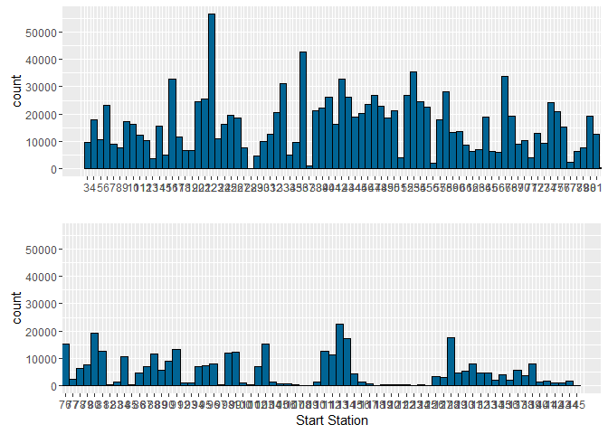

Same story with end stations.

``` r
end_station_p1 <- ggplot(data = hub_with_time, aes(x = end_statn)) + geom_histogram(binwidth = 1, fill = "#006494", color = "black") + scale_x_continuous(breaks = seq(3,145,1)) + coord_cartesian(xlim = c(3,74)) + scale_y_continuous(breaks = seq(0,60000,10000)) + labs(x = "")
end_station_p2 <- ggplot(data = hub_with_time, aes(x = end_statn)) + geom_histogram(binwidth = 1, fill = "#006494", color = "black") + scale_x_continuous(breaks = seq(3,145,1)) + coord_cartesian(xlim = c(75,145)) + scale_y_continuous(breaks = seq(0,60000,10000)) + labs(x = "End Station")

grid.arrange(end_station_p1, end_station_p2, nrow = 2)
```

    ## Warning: Removed 45 rows containing non-finite values (stat_bin).

    ## Warning: Removed 45 rows containing non-finite values (stat_bin).

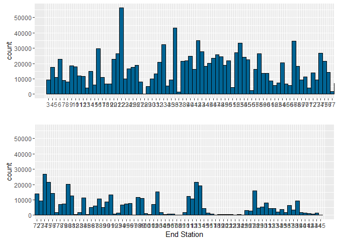

The following graph shows August, September and October are the most popular months to rent/return bikes.

``` r
hub_with_time2 <- hub %>% mutate(start_month = format(hub_with_time$start_date, "%m"), start_day = format(hub_with_time$start_date, "%d"), start_hour = format(hub_with_time$start_date, "%H"), end_month = format(hub_with_time$end_date, "%m"), end_day = format(hub_with_time$end_date, "%d"), end_hour = format(hub_with_time$end_date, "%H"))

start_month_plot <- ggplot(data = hub_with_time2, aes(x = as.numeric(start_month))) + geom_histogram(binwidth = 1, fill = "#006494", color = "black") + scale_y_continuous(breaks = seq(0,300000,100000)) + scale_x_continuous(breaks = seq(1,12,1)) + labs(x = "Month index from March to November")
end_month_plot <- ggplot(data = hub_with_time2, aes(x = as.numeric(end_month))) + geom_histogram(binwidth = 1, fill = "#006494", color = "black") + scale_x_continuous(breaks = seq(2,12,1)) + labs(x = "Month index from February to December")

grid.arrange(start_month_plot, end_month_plot, nrow = 2)
```


No specific day seems to be popular for bike renting.

``` r
start_day_plot <- ggplot(data = hub_with_time, aes(x = start_day)) + geom_histogram(binwidth = 1, fill = "#006494", color = "black") + scale_x_continuous(breaks = seq(1,31,1)) + scale_y_continuous(breaks = seq(0,60000,10000)) + labs(x ="")
end_day_plot <- ggplot(data = hub_with_time, aes(x = end_day)) + geom_histogram(binwidth = 1, fill = "#006494", color = "black") + scale_x_continuous(breaks = seq(1,31,1))+ scale_y_continuous(breaks = seq(0,60000,10000)) + labs(x = "Day of the month")

grid.arrange(start_day_plot, end_day_plot, nrow = 2)
```

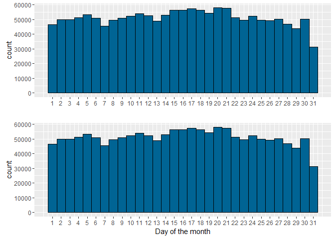

Insights
========

1.  There does not seem to be any effect on duration on trip based on gender as one would think. The following graph shows Age vs Trip Duration

``` r
ggplot(data = hub_with_time, aes(x = age, y = duration, color = gender)) + geom_jitter(alpha = 1/4) + scale_y_continuous(limits = c(0,quantile(hub_with_time$duration,0.99))) + scale_x_continuous(breaks = seq(20,90,5)) + labs(title = "Age vs Duration", x = "Age", y = "Duration of trip(in minutes")
```

    ## Warning: Removed 1229282 rows containing missing values (geom_point).

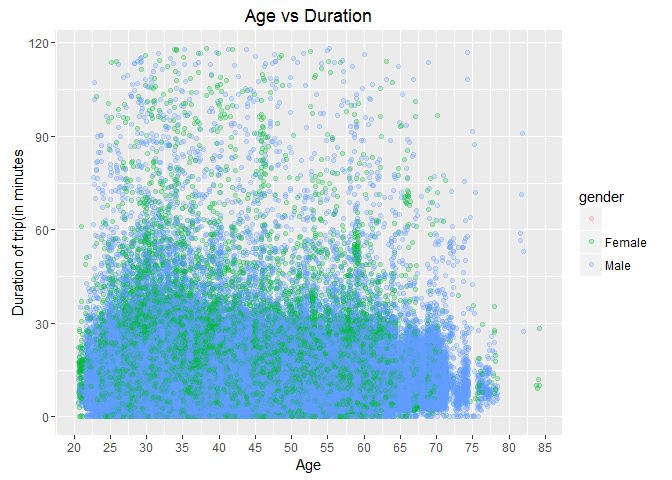

1.  Registered users of hubway seem to go on shorter trips than non-registered users.

``` r
ggplot(data = hub_with_time, aes(x = subsc_type, y = duration)) + geom_boxplot(fill = "#A5A5A5", color = "#000022") + scale_y_continuous(breaks = seq(0,40,3)) + coord_cartesian(ylim = c(0,40)) + labs(title = "Customer type vs Duration of trip", x = "Customer type", y = "Duration of trip (in minutes)")
```


1.  Stations 92, 15 and 37 are sources and destinations of longer duration trips.

``` r
start_station_box1 <- ggplot(data = hub_with_time, aes(x = as.factor(strt_statn), y = duration)) + geom_boxplot(fill = "#A5A5A5", color = "#000022") + scale_y_continuous(limits = c(0,quantile(hub_with_time$duration,0.99)), breaks = seq(0,50,5)) + coord_cartesian(xlim = c(0,47), ylim = c(0,50)) + labs(title = "Start Staion vs Duration", x = "", y = "Trip Duration (in minutes)")

start_station_box2 <- ggplot(data = hub_with_time, aes(x = as.factor(strt_statn), y = duration)) + geom_boxplot(fill = "#A5A5A5", color = "#000022") + scale_y_continuous(limits = c(0,quantile(hub_with_time$duration,0.99)), breaks = seq(0,50,5)) + coord_cartesian(xlim = c(48,95), ylim = c(0,50)) + labs(x = "", y = "Trip Duration (in minutes)")

start_station_box3 <- ggplot(data = hub_with_time, aes(x = as.factor(strt_statn), y = duration)) + geom_boxplot(fill = "#A5A5A5", color = "#000022") + scale_y_continuous(limits = c(0,quantile(hub_with_time$duration,0.99)), breaks = seq(0,50,5)) +  coord_cartesian(xlim = c(96,145), ylim = c(0,50)) +labs(x = "Start Station number", y = "Trip Duration (in minutes)")

grid.arrange(start_station_box1, start_station_box2, start_station_box3, nrow = 3)
```

    ## Warning: Removed 15837 rows containing non-finite values (stat_boxplot).

    ## Warning: Removed 15837 rows containing non-finite values (stat_boxplot).

    ## Warning: Removed 15837 rows containing non-finite values (stat_boxplot).

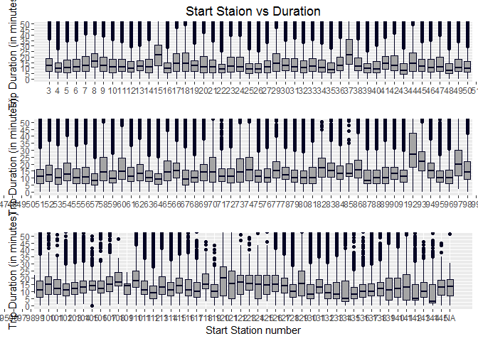

1.  Trips with same start and end stations have longer duration trips(almost twice as long).

``` r
ggplot(data = hub_with_time, aes(x = as.factor(x), y = duration)) + geom_boxplot(fill = "#A5A5A5", color = "#000022") + scale_y_continuous(limits = c(0,quantile(hub_with_time$duration,0.99)), breaks = seq(0,50,5)) + labs(x = "1-Same start and end stations. 0- Different start and end stations", y = "Trip duration (in minutes)")
```

    ## Warning: Removed 15837 rows containing non-finite values (stat_boxplot).


1.  Station 22 is single handedly most popular for bike rentals. 36 is second most popular station.

``` r
start_station_p1 <- ggplot(data = hub_with_time, aes(x = strt_statn)) + geom_histogram(binwidth = 1, fill = "#006494", color = "black") + scale_x_continuous(breaks = seq(3,145,1)) + coord_cartesian(xlim = c(3,78)) + scale_y_continuous(breaks = seq(0,60000,10000)) + labs(x = "")
start_staion_p2 <- ggplot(data = hub_with_time, aes(x = strt_statn)) + geom_histogram(binwidth = 1, fill = "#006494", color = "black") + scale_x_continuous(breaks = seq(3,145,1)) + coord_cartesian(xlim = c(79,145)) + scale_y_continuous(breaks = seq(0,60000,10000)) + labs(x = "Start Station")

grid.arrange(start_station_p1, start_staion_p2, nrow = 2)
```

    ## Warning: Removed 14 rows containing non-finite values (stat_bin).

    ## Warning: Removed 14 rows containing non-finite values (stat_bin).


1.  August, September and October are the most popular months to rent bikes.

``` r
hub_with_time2 <- hub_with_time %>% mutate(start_month = format(hub_with_time$start_date, "%m"), start_day = format(hub_with_time$start_date, "%d"), start_hour = format(hub_with_time$start_date, "%H"), end_month = format(hub_with_time$end_date, "%m"), end_day = format(hub_with_time$end_date, "%d"), end_hour = format(hub_with_time$end_date, "%H"))

start_month_plot <- ggplot(data = hub_with_time2, aes(x = as.numeric(start_month))) + geom_histogram(binwidth = 1, fill = "#006494", color = "black") + scale_y_continuous(breaks = seq(0,300000,100000)) + scale_x_continuous(breaks = seq(1,12,1)) + labs(x = "Month index from March to November")
end_month_plot <- ggplot(data = hub_with_time2, aes(x = as.numeric(end_month))) + geom_histogram(binwidth = 1, fill = "#006494", color = "black") + scale_x_continuous(breaks = seq(2,12,1)) + labs(x = "Month index from February to December")

grid.arrange(start_month_plot, end_month_plot, nrow = 2)
```

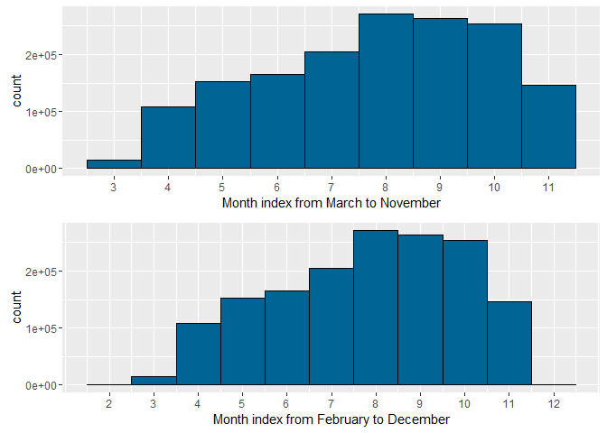
